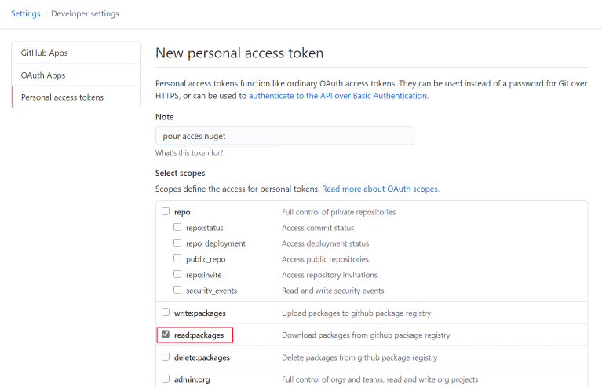

# Se connecter au SDK OnPremise

## Créer un compte Github

Si vous n'en avez pas encore, créez un compte Github.

## Demander l'accès

Pour l'instant, l'accès à notre SDK _OnPremise_ est uniquement possible après avoir été accepté dans notre programme Partenaires. Pour plus de renseignements merci de nous contacter via l'email présente sur notre profil Github [https://github.com/altazion](https://github.com/altazion).

## Créer un token PAT

- Accédez à vos options utilisateurs sur GitHub

- Allez dans les options développeurs puis dans Personnal Access Token 
- Créez un nouveau Token
 

 
- Donnez lui un nom puis cochez le choix read:packages

 
- Validez la création
- Notez le code qui vous est donné en retour : vous ne pourrez plus le retrouver facilement après avoir quitté cette page

## Ajoutez la source de package dans visual studio

- ouvrez visual studio
- ouvrez les options et cherchez le groupe "Sources de packages nugets"
- Ajoutez une ligne dans les sources avec les informations qui vous seront fournies lors de votre acceptation au programme Partenaires.

- Créez un projet simple (une application console .net framework 4.6.1+) et cliquez sur _Gérer les packages nuget_
- Modifiez la source dans l'angle en haut à gauche pour choisir celle que vous venez de créer

- Saisissez votre identifiant Github et le token PAT en tant que mot de passe