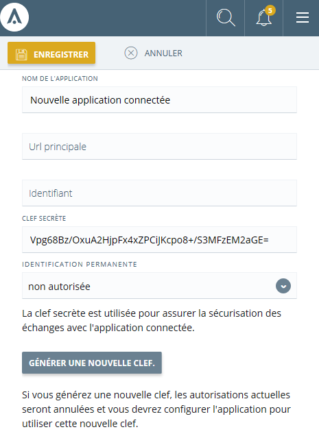
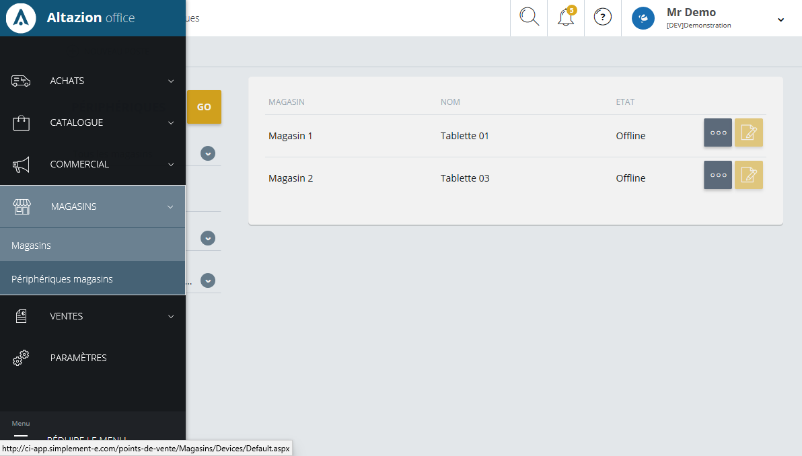

# API Phygitale

L'API phygitale vous permet de vous connecter à simplement-e et de réaliser des opérations de parcours de produits, de suivi de clients et de commandes, etc. Elle est basé sur REST, est sécurisée via un échange de token et de permissions accordées par un administrateur, et doit toujours être utilisée au travers d'une connexion HTTPS.

>[!NOTE]
>Si vous développez votre application en .net, sous Windows ou avec des outils Xamarin, vous pouvez télécharger un package nuget depuis notre serveur public pour faciliter vos développements.

## Fonctionnement général de l'API

L'API Phygitale a été conçue pour :

- Etre utilisée pour des devices "personnels" et utilisables par un seul et unique utilisateur en simultané
- Etre intégrable dans toute solution quelque soit la plateforme utilisée, via l'utisation de REST

Elle est particulière adaptée à la réalisation d'applications d'aide à la vente, de prise de commande ou de checkout. Ces fonctionnalités permettant de réaliser des opérations demandant des permissions importantes, les devices utilisés doivent être authentifiés auprès du système.

### Création d'une application

Pour pouvoir utiliser l’API et authentifier vos appels, la première chose à créer est une application connectée dans le back-office. Vous obtiendrez ainsi des identifiants permettant de réaliser vos opérations.

La procédure est assez simple : vous devez avoir des droits d’administration des fonctionnalités et accèder à l’écran _Paramètres_ > _Extensibilité_ > _Applications connectées_. Créez une nouvelle application :



Conservez l'identifiant et la clef, ils vous serviront à établir la connexion avec l'API.

### Gestion des devices

En complément de l’identification de l’application, chaque device doit être déclaré dans le back-office. L'identification se fait via un simple nom de périphérique. Nous vous conseillons d'utiliser le FQDN (le nom complet du device, en incluant son nom de domaine. par exemple : `WINRS87234.macompany.com`) pour identifier un device, mais toute données suffisamment unique peut aussi faire l'affaire.

Lorsque vous commencerez à utiliser l'API, la première opération que vous devrez réaliser est un "login" de votre device sur la plateforme : c'est cet identifiant qui devra alors être utilisé.

Pour créer un device, vous devez avoir accès à l'écran _Magasins_ > _Périphériques magasins_.



Pour plus d'informations, reportez-vous à l'aide en ligne associée à cette fonction.

>[!WARNING]
> Attention, n'utilisez jamais le même identifiant pour plusieurs devices (tablettes, bornes, etc.) : l'autentification se fait à chaque appel de votre périphérique sur nos modules API. Si plusieurs devices partagent la même identité, cette autentification sera invalidée.

Si vous essayez de vous connecter avec un device non déclaré, une tâche sera automatiquement créée dans le back-office pour vous faciliter la création de celui-ci.

## Développer une application

### En utilisant le SDK

Selon vos besoins, vous pouvez utiliser plusieurs niveaux d’abstraction :

- Utiliser les objets métiers
- Appeler directement les webservices.
  
Dans le reste de cette documentation, nous prendrons comme principe que vous utilisez nos modules nuget pour établir la connexion au serveur et réaliser les appels. Chaque service sera d'abord decrit en terme d'échanges "bruts", puis l'objet métier encapsulant l'appel vous sera présenté. L'utilisation de ces objets métiers est facultatif : ils ne sont que des classes Helper regroupant la logique d'appel au service. Nous vous invitons, même si vous réalisez vos appels au web-services "manuellement", à utiliser nos objets de désérialisation : cela vous permettra d'être sûr du format de chaque information.

#### Créer le projet

A titre d'exemple, nous allons créer une simple application console windows qui se connectera au services phygitaux et exécutera quelques appels API. Vous pouvez retrouver le projet dans son intégralité dans notre repository github :
https://github.com/simplement-e/samples/tree/master/PhygitalSampleApp

#### Initialisation de l’application

Pour utiliser nos modules, vous devez implémenter une classe dérivée de
`Equihira.Phygital.Client.Business.ApplicationModelBase`

Cette classe contient des propriétés pour identifier votre device et ses éléments associés (tels que le magasin, le vendeur, etc.) et des évènements concernant l’état de connexion au serveur.

Etant donné qu’aucune méthode n’est abstract, l’implémentation minimale est très simple :

``` csharp
public class MyApplicationModelBase : ApplicationModelBase
{
}
```

Nous vous conseillons aussi d’utiliser la classe suivante pour vous aider à établir la connexion au serveur et vous simplifier l’utilisation de nos outils.

``` csharp
public static class MyApp
{
    /// <summary>
    /// Le data-model principal de l'application
    /// </summary>
    public static MyApplicationModelBase Model
    {
        get { return ApplicationModelBase.Instance as MyApplicationModelBase; }
    }

    private static bool _otherInitDone = false;
    private static string _deviceName = null;

    /// <summary>
    /// Méthode d'initialisation de l'application
    /// </summary>
    /// <typeparam name="T">Le type de data-model pour l'application</typeparam>
    /// <param name="urlServer">L'url du serveur</param>
    /// <param name="appId">L'id de votre application</param>
    /// <param name="appKey">La clef secrete associée à votre application</param>
    /// <param name="deviceName">Le nom sous lequel ce poste doit être enregistré</param>
    /// <param name="model">Le data-model à associer à l'application</param>
    /// <returns><c>true</c> si la connexion à pu s'établir</returns>
    /// <remarks>Si vous obtenez <c>false</c> en retour de cette méthode, vous n'aurez aucun accès
    /// aux web-services et devrez ré-essayer après avoir vérifié vos paramètres, la possibilité
    /// de vous connecter au serveur et que le device est bien enregistré.</remarks>
    public static void Init<T>(string urlServer, string appId, string appKey, string deviceName, T model)
        where T : ApplicationModelBase, new()
    {
        if (!_otherInitDone)
        {
            _otherInitDone = true;
            try
            {
                _deviceName = deviceName;
                DataService.SetImpl(new NetDataServiceImpl());
                ApplicationModelBase.Init<T>(model);
                WebServiceConnectionService.Init(urlServer, appId, appKey);
            }
            catch
            {
                _otherInitDone = false;
            }
        }
    }


    /// <summary>
    /// Méthode d'initialisation de l'application en instanciant un nouvel objet
    /// du type donné
    /// </summary>
    /// <typeparam name="T">Le type de data-model pour l'application</typeparam>
    /// <param name="urlServer">L'url du serveur</param>
    /// <param name="appId">L'id de votre application</param>
    /// <param name="appKey">La clef secrete associée à votre application</param>
    /// <param name="deviceName">Le nom sous lequel ce poste doit être enregistré</param>
    /// <returns><c>true</c> si la connexion à pu s'établir</returns>
    /// <remarks>Si vous obtenez <c>false</c> en retour de cette méthode, vous n'aurez aucun accès
    /// aux web-services et devrez ré-essayer après avoir vérifié vos paramètres, la possibilité
    /// de vous connecter au serveur et que le device est bien enregistré.</remarks>
    public static void Init<T>(string urlServer, string appId, string appKey, string deviceName)
        where T : ApplicationModelBase, new()
    {
        T val = null;

        if (ApplicationModelBase.Instance != null)
            val = ApplicationModelBase.Instance as T;

        if (val == null)
            val = new T();

        Init(urlServer, appId, appKey, deviceName, val);
    }

    /// <summary>
    /// Connecte l'application
    /// </summary>
    /// <param name="startCreationIfInexistant">si <c>true</c>, un todo de demande
    /// de création sera ajouté dans votre gestion commerciale</param>
    /// <returns><c>true</c> si la connexion a pu être établie</returns>
    public static async Task<bool> Connect(bool startCreationIfInexistant = false)
    {
        IdentityBll bll = new IdentityBll();
        bool b = await bll.ConnectAsync(_deviceName, ApplicationModelBase.Instance);
        return b;
    }

    /// <summary>
    /// Effectue un test de connexion. Attention, même en cas de réussite,
    /// la connexion n'est pas permanente. Vous devez appeler <see cref="Connect"/>
    /// pour établir la connexion définitive.
    /// </summary>
    /// <param name="startCreationIfInexistant">si <c>true</c>, un todo de demande
    /// de création sera ajouté dans votre gestion commerciale</param>
    /// <returns><c>NotConnected</c> si la connexion a échoué, <c>DeviceUnknown</c> si le 
    /// device n'est pas enregistré ou <c>Connected</c> si la connexion a 
    /// été établie</returns>
    internal static async Task<IdentityBll.ConnectionResult> TryConnectAsync(string url, string nomPoste, bool createIfInexistant)
    {
        return await new IdentityBll().TryConnectAsync(url, nomPoste, createIfInexistant);
    }

    /// <summary>
    /// Vérifie si on a une url serveur enregistrée
    /// </summary>
    /// <returns><c>false</c> si aucune url n'est enregistrée</returns>
    internal static bool HasServerUrl()
    {
        return !string.IsNullOrEmpty(WebServiceConnectionService.Url);
    }

    /// <summary>
    /// Enregistre l'url et le nom de poste pour
    /// les connexions futures
    /// </summary>
    /// <param name="url">url du serveur</param>
    /// <param name="nomPoste">nom du poste</param>
    internal static async Task SaveConnectParameters(string url, string nomPoste)
    {
        await new IdentityBll().SaveConnectParameters(url, nomPoste);
    }
}
```

#### Connexion au serveur

En utilisant les classes définie précédemment, la connexion au serveur se fait simplement en utilisant :

```csharp
MyApp.Init<MyApplicationModelBase>(null,
      _votre_app_id_, _votre_app_key_, _le_nom_du_device_);

// vous pouvez ensuite vous connecter

if (!MyApp.HasServerUrl())
{
    var t = await MyApp.TryConnectAsync(url, nomPoste, true);
    if (t == IdentityBll.ConnectionResult.DeviceUnknown)
    {
            // traiter le cas où le poste n’est pas 
            // créé dans la gestion commerciale
    }
    else if (t == IdentityBll.ConnectionResult.Connected)
    {
        try
        {
            await MyApp.SaveConnectParameters(url, nomPoste);
        }
        catch
        {

        }
    }
    else
    {
            // il est impossible de se connecter
    }
}

bool b = await MyApp.Connect(true);
// si b vaut true, vous êtes connecté au serveur
// dans la cas contraire, re-tentez un TryConnectAsync
// pour connaitre le type de problème rencontré
```

Les identifiants (nom du poste et url de connexion) sont sauvegardés pour être automatiquement utilisés lors de vos prochaines connexion. Si vous connaissez par avance ces informations, nous vous invitons à appeler MyApp.SaveConnectParameter() avant de réaliser votre première tentative de connexion.

#### Appeler un service API

Une fois connecté, vous pouvez utiliser nos objets métier afin de réaliser les appels aux APIs.

Si vous souhaitez réaliser vous même les appels, la classe `WebServiceConnectionService` permet de faire des appels à l’API.
Pour cela, il suffit d’utiliser l’une des surcharge de la méthode `DownloadStringAsync`.

```csharp 
public static async Task<string> DownloadStringAsync(string relativeUrl, ...)
```

Cette méthode s’occupe de passer les identifiants nécessaires et vous retourne la valeur json non parsée provenant du serveur. Si l’appel tombe en erreur, une exception de type WebServiceException sera levée.

#### Récupération de la configuration du device

Il est possible, via simplement-e de définir la configuration d’un device et de fournir des options paramétrables. Il y a deux flux de configuration disctinct :

- un fichier de configuration XML, accessible via la propriété RawConfig du Model. Cette propriété est surtout destinée aux données techniques. A n’utiliser, donc, que si vous avez besoin d’obtenir des informations systèmes sur le device.
- Un ensemble de paramètres, disponibles via la propriété DeviceOptions sur le Model. Il s’agit d’un `Dictionary<string, string>` contenant toutes les propriétés configurables pour un device ou pour son type.

### Appels directs

Si vous ne souhaitez pas ou ne pouvez pas utiliser nos package nuget, vous pouvez réaliser vos appels directement via HTTP. Afin d'identifier le device qui réalise les opérations et de conserver les informations d'un appel à l'autre, vous devrez fournir à chaque appel à l'un de nos points API un token d'authentication. Ce token identifie de manière unique votre device et ne doit pas être partagé : en cas d'utilisation d'un token provenant de plusieurs devices en parallèle, celui-ci sera invalidé et ne permettra plus d'authentifier vos appels.

Ce token devra être passé en tant que header d'authentification HTTP de type "bearer". Par exemple (ligne 2) :

```http
GET http://miam-miam.demo-e-phygital.fr/v2/catalogue/ HTTP/1.1
Authorization: bearer MT.....==
UserAgent: DemoApp
Accept: application/json
E_AppId: DemoApp
Host: miam-miam.demo-e-phygital.fr
``` 
#### Obtention du token

Afin d'obtenir ce token, vous devrez d'abord réaliser un premier appel à un point API spécifique d'autentification. Celui-ci se trouve à l'adresse :

    /auth/connect?device={deviceName}

Où `{deviceName}` est un nom de device unique pour toute votre entreprise. Nous vous conseillons d'utiliser le nom de domaine complètement qualifié (FQDN) de votre device (par exemple : `POSTE01.macompany.com`).

Cet appel devra être autentifié en mode Basic, et en utilisant l'identifiant de votre application (cf. ci-dessus) en tant que nom d'utilisateur et sa clef secrete en tant que mot de passe, par exemple :

    e_monappid:EsaFy/WEJ70IQAe3Bh9pY49EVnW62WgkHTewmWjLK28=

vous recevrez en échange un objet de type TokenInfo en json. Utilisez la propriété Token pour récupérer votre identifiant.

```csharp
class TokenInfo
{
    bool IsChildToken { get; set; }
    string Token { get; set; }
    Guid DeviceGuid { get; set; }
    Guid StoreGuid { get; set; }
    DateTime ExpirationDate { get; set; }
}
```